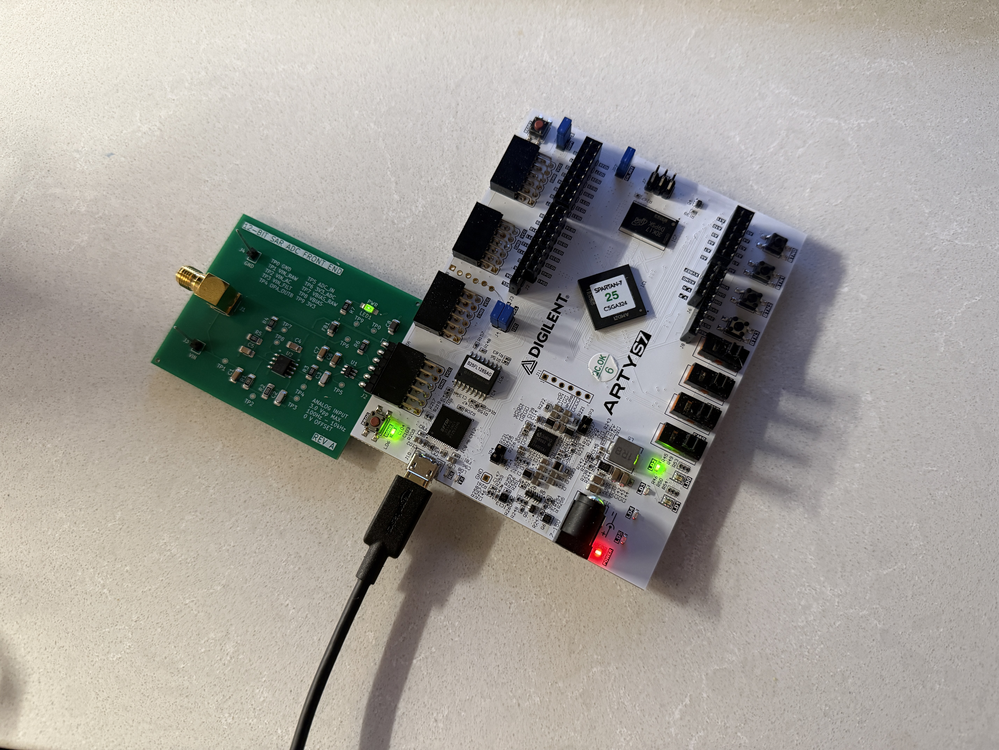

# Mixed-Signal PCB and FPGA Signal Acquisition System
***Repository Status:*** *This repository is actively being updated as I organize project photos, test/validation results, and technical documentation.*

Custom mixed-signal data acquisition platform designed around an ADCS7476 ADC and Digilent Arty S7 FPGA. The system receives and conditions an analog input signal on a custom PCB, performs analog to digital conversion, and then transfers sampled data to the FPGA for digital signal processing.

